# Example shaders

- [Gradient](#gradient)
- [Game of Life](#game-of-life)
- [BZ reaction](#bz-reaction)
- [BZX](#bzx)
- [Hamilton-Jacobi](#hamilton-jacobi)
- [Reaction stream](#reaction-stream)
- [Flux](#flux)
- [Dots](#dots)
- [Plot](#plot)
- [Two body](#two-body)
- [Broken Lieuville](#broken-lieuville)
- [XOR](#xor)

## Gradient

Shows a static RGB gradient. Boring demo but looks cool.

[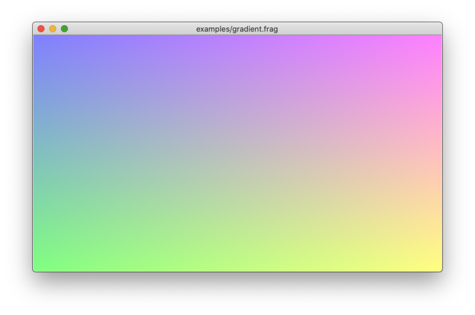](./gradient.frag)

## Game of Life

Game of Life. In this demo life is constantly generated from a horizontal line.

[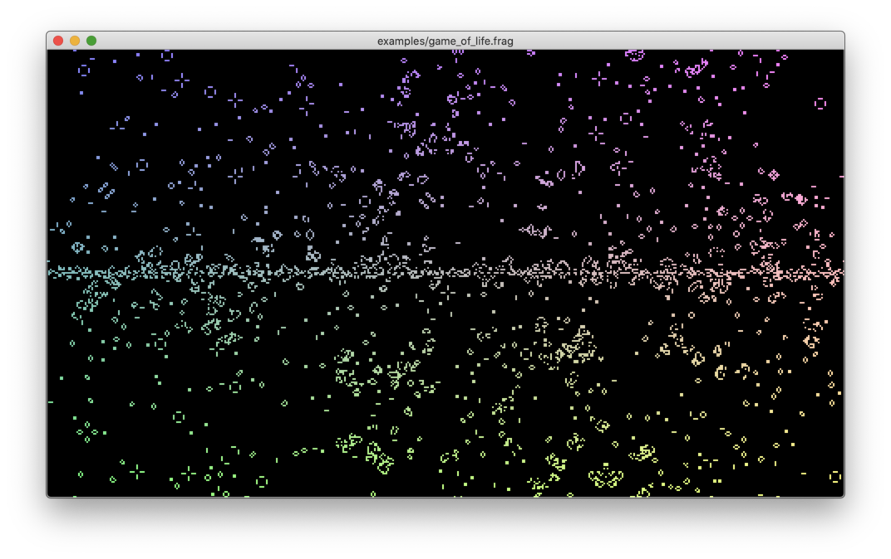](./game_of_life.frag)

## BZ reaction

Belousov–Zhabotinsky reaction. Move mouse cursor on the window and see the
psychedelic consequence!

[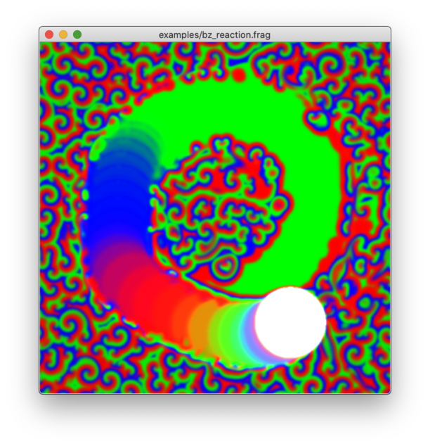](./bz_reaction.frag)

## BZX

Modification of BZ reaction. This one tends to show propagating diagonal lines.

[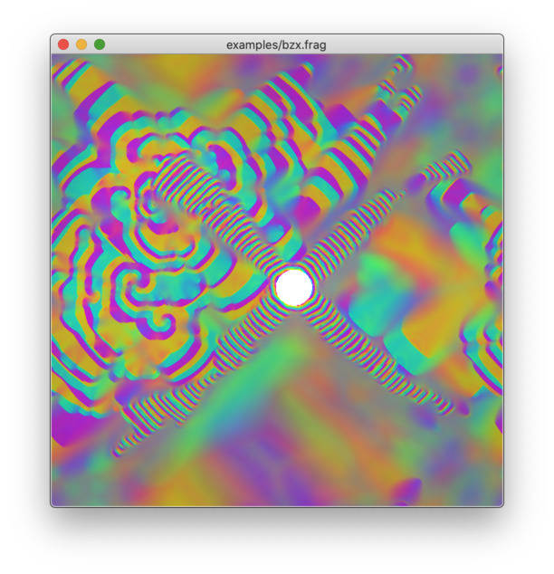](./bzx.frag)

## Hamilton-Jacobi

A demo scene inspired by the Hamilton-Jacobi equation of a two-dimensional
harmonic oscillator. The demo renders momentum field. It shows interesting
wave patterns; these waves probably come from numerical errors though.

[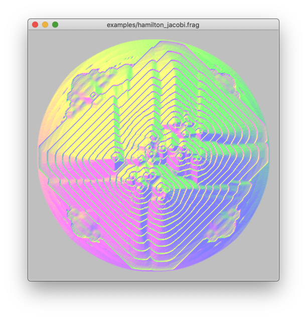](./hamilton_jacobi.frag)

## Reaction stream

Rainbow streamlines. The scene is generated by solving the rate equation of a
massive reaction network consisting of negative feedback modules.

[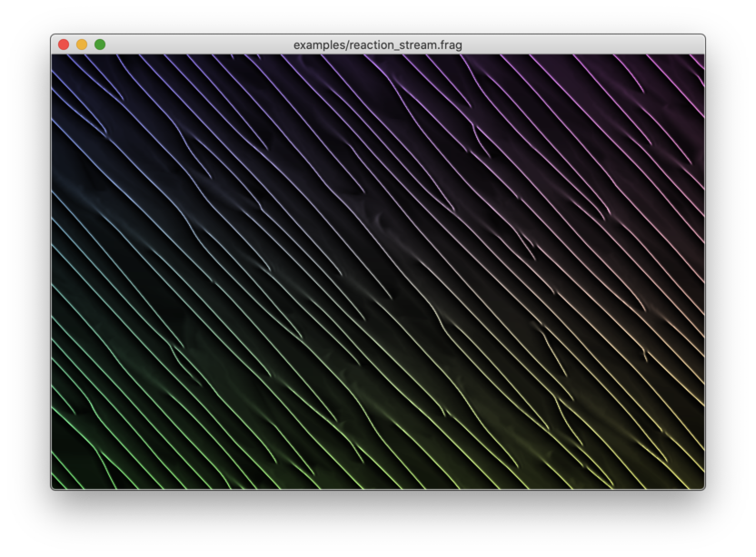](./reaction_stream.frag)

## Flux

Pseudo-fluid simulation. The scene is created by simulating the time evolution
of a field equation inspired by the continuity equation. This shader uses RGB
channels to store vector and scalar fields.

## Dots

Contour plot of a time-and-mouse-dependent implicit function.

[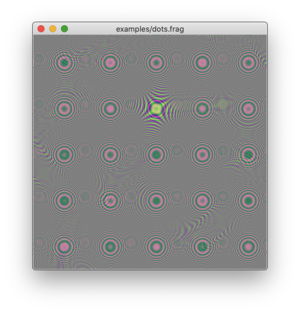](./dots.frag)

## Plot

Plotting a function. The shader needs to transform texture coordinates to graph
coordinates to evaluate the function. It also needs to determine if the fragment
pixel is on the function graph.

[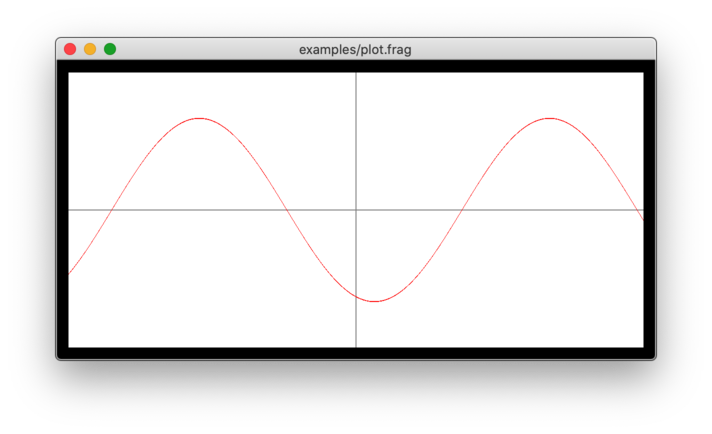](./plot.frag)

## Two body

Two-body simulation of gravitational particles. This shader abuses some pixels
for storing simulation state (not graphical output). You see the "state pixels"
at the lower left edge of the scene.

[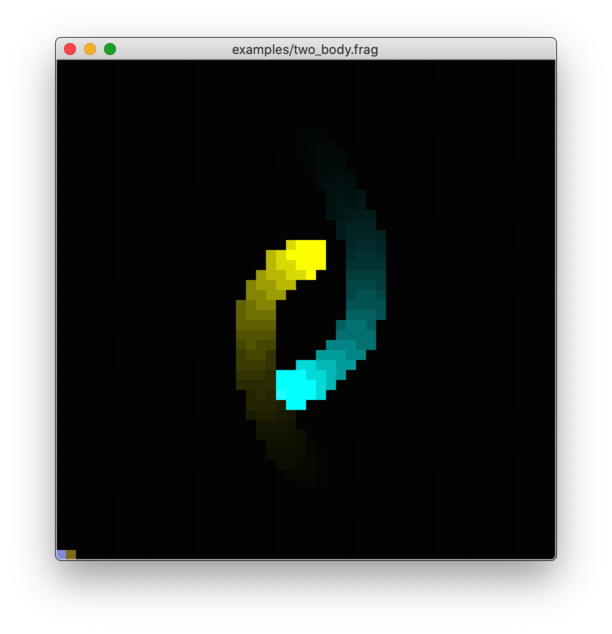](./two_body.frag)

## Broken Lieuville

Time evolution of phase space of the simple harmonic oscillator. It numerically
solves Lieuville equations. The calculation is horribly broken due to numerical
error and failed smoothing effort but it looks cool nevertheless.

[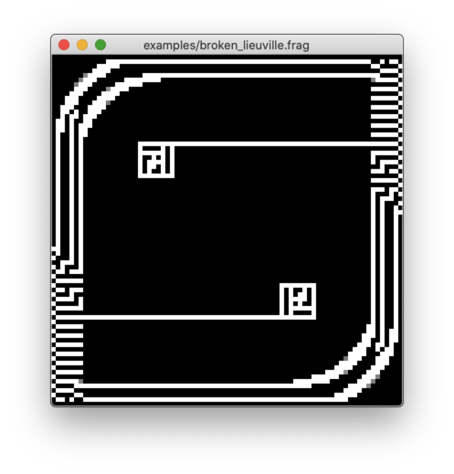](./broken_lieuville.frag)

## XOR

8-state cellular automaton involving some XOR calculations. Results in localized
oscillators that somewhat look like an electronic circuit.

[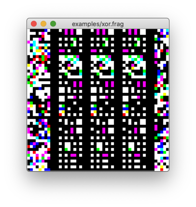](./xor.frag)
