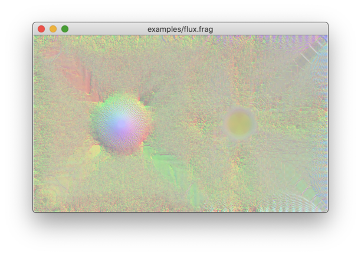

# Example shaders

- [Gradient](#gradient)
- [Game of Life](#game-of-life)
- [BZ reaction](#bz-reaction)
- [BZX](#bzx)
- [Hamilton-Jacobi](#hamilton-jacobi)
- [Reaction stream](#reaction-stream)
- [Flux](#flux)
- [Dots](#dots)

## Gradient

Shows a static RGB gradient. Boring demo but looks cool.

## Game of Life

Game of Life. In this demo life is constantly generated from a horizontal line.

## BZ reaction

Belousov–Zhabotinsky reaction. Move mouse cursor on the window and see the
psychedelic consequence!

## BZX

Modification of BZ reaction. This one tends to show propagating diagonal lines.

## Hamilton-Jacobi

A demo scene inspired by the Hamilton-Jacobi equation of a two-dimensional
harmonic oscillator. The demo renders momentum field. It shows interesting
wave patterns; these waves probably come from numerical errors though.

## Reaction stream

Rainbow streamlines. The scene is generated by solving the rate equation of a
massive reaction network consisting of negative feedback modules.

## Flux

Pseudo-fluid simulation. The scene is created by simulating the time evolution
of a field equation inspired by the continuity equation. This shader uses RGB
channels to store vector and scalar fields.

## Dots

Contour plot of a time-and-mouse-dependent implicit function.

